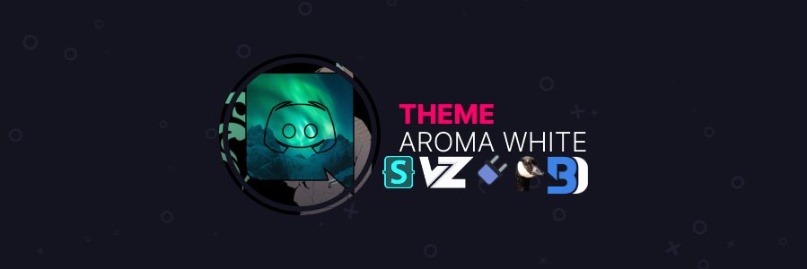

<div align='center'>
  

# AROMA WHITE DISCORD THEME  
# NOW COMPATABLE WITH ALL POPULAR MODS
This is a custom theme for Discord that I currently Maintain myself  
As of the many updates this is now SUPPORTING Several Clients  
I do not claim credit for any of the code as this is a mash of many snips from the PowerCord Discord  
You can toggle individual aftermods in the Aroma.theme.css  
# HOW TO INSTALL  
>PowerCord - run `git clone https://github.com/PhoenixAceVFX/Aroma-White` in your theme directory.  
>BetterDiscord - Place Aroma.theme.css in Themes Folder!  
>GooseMod - Get it in the theme store!  
>Stylus - [Click Here to install](https://github.com/PhoenixAceVFX/Aroma-White/raw/main/Aroma.user.css)  
>Vizality - Should be the same as other Vizality themes.  
# GOOSEMOD CUSTOMIZATION  
Simply use this code to customize the theme in your Custom CSS in GooseMod (CUSTOM CSS PLUGIN REQUIRED)  
Module Selection Hopefully coming soon to GooseMod  
```css
:root {	
/*User Modal Size*/
  --user-modal-width: 900px;
  --user-modal-height: 600px;
/*Color Variables*/	
	--main-color: linear-gradient(150deg, var(--gradient1), var(--gradient2)); /*Accent Color of the Theme*/	
	--gradient1: #3ecc9c; /*First Gradient Color*/	
	--gradient2: #185a9d; /*Second Gradient Color*/	
	--hover-color: rgb(67, 206, 162); /*Secondary Accent of the Theme*/	
	--main-color-faded: rgba(67, 206, 162, 0.2); /*Faded Main Color*/	
/*Backdrop Variables*/	
	--backdrop: url(https://i.imgur.com/xcjXx3E.jpg); /*Normal Backdrop*/	
	--backdropblurred: url(https://i.imgur.com/ExNrzGV.jpg); /*Darker/Blurred Version of Backdrop*/	
	--backdrop-darkness:transparent; /*Brightness of var(--backdrop);*/	
/*Roundness Variables*/	
	--chat-avatar-roundness:5px !important; /*Roundness of chat avatars*/	
	--media-roundness:50px !important; /*General Roundness*/	
	--guild-hovered-roundness:12px !important; /*Roundness of servers on hover*/	
/*Status Variables*/	
	--online: #43b581 !important; /*Color When someone is Online*/	
	--idle: #faa61a !important; /*Color When someone is Idle*/	
	--dnd: #f04747 !important; /*Color When someone is in Do Not Disturb*/	
	--offline: #636b75 !important; /*Color When someone is offline*/	
	--invisible: #747f8d !important; /*Color When someone is Invisible*/	
	--streaming: #643da7 !important; /*Color When someone is Streaming*/	
}
```
# PREVIEW  
  
  
  
  
  
  
  
  
  